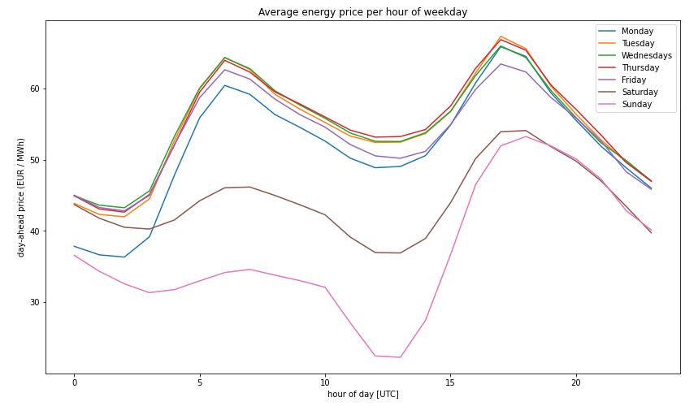

# green_charging_emobility
Open Energy Data Hackdays 2021

[Link to challenge on Hackdays](https://hack.opendata.ch/project/768). Please join this challenge!

## Results

### CO2 intensity of the Swiss electricity mix
* inversely correlates with SwissIX: Swiss hydro produces in high price hours preferably.
* in low price hours: determined by imports which are themselves influenced by weather (wind, temperature)
* there are clear seasonal and workday / weekend trends
* however, individual days can be very different!

### SwissIX dayahead
01.01.2020 until 25.09.2021

### CO2 reduction potential

#### shift charging within the duration of the charging process
cars are usually plug in for longer than they need. How much CO2 could we save if we optimize charging within the timespan
in which the car is connected to the charging station?

-> about 10-15 %

### shift charging up to 12 hrs after the end of the charging process
this mostly means to take potential workplace charging into account

-> about 20-30 %

## Template notebook

Please start each analysis by duplicating the notebook `Notebooks/Notebook template.ipynb`.

## Annotated meter data format

* 'id': `int`. Unclear, not used.
* 'Chargepoint': `object`. The unique identifier (number or UUID) of the physical charging station. One station can have more than one cable, and hence more than one charging session.
* 'connector': `object`. The unique identifier (number or UUID) of the physical cable or attached device. In some cases, a cable can be left in the charging station for a long period of time, and used for multiple charging stations.
* 'unique_charge_point': `str`. A unique identifier (str) for a combination of outlet and charger. Formed by joining the `Chargepoint` and `connector` with a `|` character.
* 'charge_log_id': `object`. The unique identifier (number or UUID) of a particular session charging a battery
* 'metervalue': `int`. Not used
* 'increment': `int`. The amount of energy transferred (in watt-hours) in the last 15 minutes (i.e. up to the 'timestamp' value)
* 'timestamp': `numpy.datetime64[ns]` without timezone. The time of measurement in UTC.
* 'co2_intensity': `float`. Interpolated CO2 intensity (in g CO2-eq. / kWh) at the time of charging
* 'co2_total': `float`. Total CO2 (in kg CO2-eq.) produced during this charging session.

## Raw meter data format

* 'id': Unclear, not used.
* 'Chargepoint': The unique identifier (number or UUID) of the physical charging station. One station can have more than one cable, and hence more than one charging session.
* 'connector': The unique identifier (number or UUID) of the physical cable or attached device. In some cases, a cable can be left in the charging station for a long period of time, and used for multiple charging stations.
* 'charge_log_id': The unique identifier (number or UUID) of a particular session charging a battery
* 'metervalue': Not used
* 'increment': The amount of energy transferred (in watt-hours) in the last 15 minutes (i.e. up to the 'timestamp' value)
* 'timestamp': The time of measurement in UTC.

## CO2 data format

Columns are renamed to fit those used in [the notebook here](https://github.com/invveritas/green_charging_emobility/blob/main/Notebooks/Merge%20meter%20with%20CO2%20data.ipynb).

### Generic columns

* 'datetime': The time of measurement in UTC.
* 'co2_intensity': The CO2 intensity (g co2/kWh)
* 'co2_production': The CO2 intensity of Swiss production (g co2/kWh)
* 'co2_import': The CO2 intensity of imported electricity (g co2/kWh)

### Power in the CH consumption mix (production plus imports minus exports)

All values in MW
* 'nuclear
* 'geothermal'
* 'biomass'
* 'coal'
* 'wind'
* 'solar'
* 'hydro'
* 'gas'
* 'oil
* 'unknown'
* 'battery'
* 'hydro'
* 'consumption': Total consumption in CH (MW)
* 'production': Total production in CH (MW)

## Coding standards

Please store notebooks in the `Notebooks` directory.

Please store data in the `Data` directory. It will be ignored by git. The data files should be named:

* CH 2020-2021.csv
* metervalues_pseudonymized_2_neu.csv
* metervalues_pseudonymized_1_neu.csv

## Data peculiarities

* An `increment` with values of more than 5500 Wh does not make sense. The maximum power of chargers is 22 kW. The data should be cleaned by removing all values of all charge_log_ids that have at least one value of increment > 5500 Wh.
* Some values for 'Chargepoint' are NaN. Luckily this is only the case where the connector is identified by a UUID. Hence we can replace the NaN with a unique number based on the connector UUID
